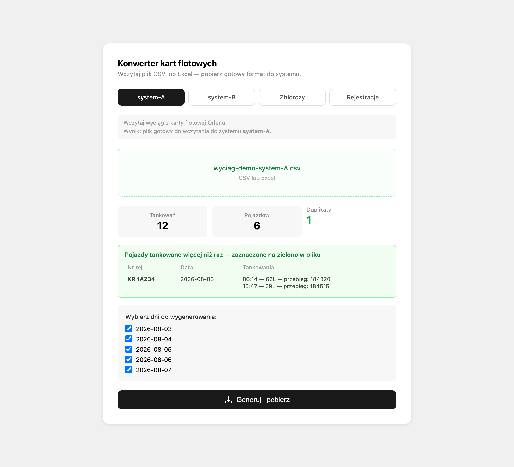

# Konwerter kart flotowych

Narzędzie, które zamienia wyciąg z kart paliwowych na arkusz gotowy do wczytania
do systemu rozliczeniowego. **Używane produkcyjnie codziennie. Klient odzyskał
ponad godzinę pracy tygodniowo** — to jedyna twarda liczba w moim portfolio
i pochodzi od niego, nie ode mnie.

```
otwórz index.html w przeglądarce
```

Nie ma instalacji, nie ma builda, nie ma zależności npm. Jeden plik.



## Problem

Dane o tankowaniach z kart flotowych przychodzą w formacie, którego nie da się
wprost wczytać do systemu rozliczeń. Zestawienia powstawały przez ręczne
przepisywanie — czasochłonne i podatne na błędy, które ujawniały się dopiero przy
zamknięciu okresu.

## Co robi

- czyta **CSV i Excel**, rozpoznaje dwa różne układy kolumn i sam wybiera parser,
  z awaryjnym przełączeniem, gdy plik jest z drugiego źródła;
- **wykrywa duplikaty** — ten sam pojazd tankowany dwa razy tego samego dnia —
  i zaznacza je w wygenerowanym arkuszu na zielono;
- **wyłapuje błędne odczyty licznika** (przebieg mniejszy niż poprzedni) i
  zaznacza je na czerwono;
- **podświetla pojazdy spoza listy aktywnych rejestracji** na pomarańczowo;
- pozwala wybrać, które dni wygenerować, i pakuje wiele plików w jedno ZIP;
- **działa w całości w przeglądarce** — dane nie opuszczają komputera
  użytkownika. To nie jest szczegół techniczny, tylko powód, dla którego klient
  mógł zacząć go używać bez pytania kogokolwiek o zgodę.

## Spróbuj

W katalogu [`przyklad/`](./przyklad) są dwa pliki wejściowe z danymi zmyślonymi,
przygotowane tak, żeby pokazać wykrywanie:

| Plik | Co w nim siedzi |
|---|---|
| `wyciag-demo-system-A.csv` | duplikat (`KR 1A234`, 2026-08-03, dwa tankowania), cofnięty licznik (`NS 9C012`) i pojazd spoza listy (`KR 8Z999`) |
| `wyciag-demo-system-B.csv` | drugi układ kolumn — inny parser, ten sam wynik |

## Czym różni się od wersji produkcyjnej

Trzema rzeczami, wszystkie z powodu anonimizacji:

1. **Lista aktywnych rejestracji leży w `localStorage`, nie w Supabase.**
   U klienta jest wspólna dla całej firmy i trzymana w bazie; tutaj podmieniona,
   żeby w repozytorium nie było żadnych kluczy dostępowych. Wymieniona jest
   wyłącznie ta jedna warstwa — jest oznaczona komentarzem w kodzie.
2. **Nazwy docelowych systemów** zastąpione przez `system-A` i `system-B`.
3. **Logotypy** klienta i operatora kart usunięte.

Reszta pliku — parsery, wykrywanie duplikatów, generowanie XLSX, pakowanie ZIP —
jest kodem produkcyjnym bez zmian.

## Stack

`HTML` · `JavaScript` (bez frameworka) · [`SheetJS`](https://sheetjs.com) ·
[`JSZip`](https://stuk.github.io/jszip/)
