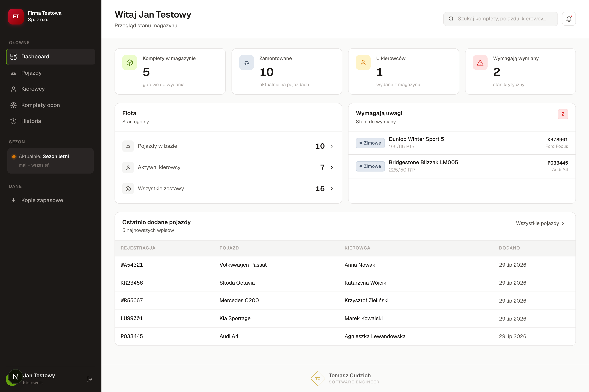
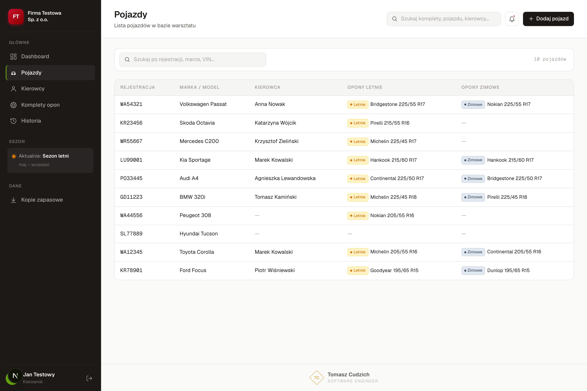
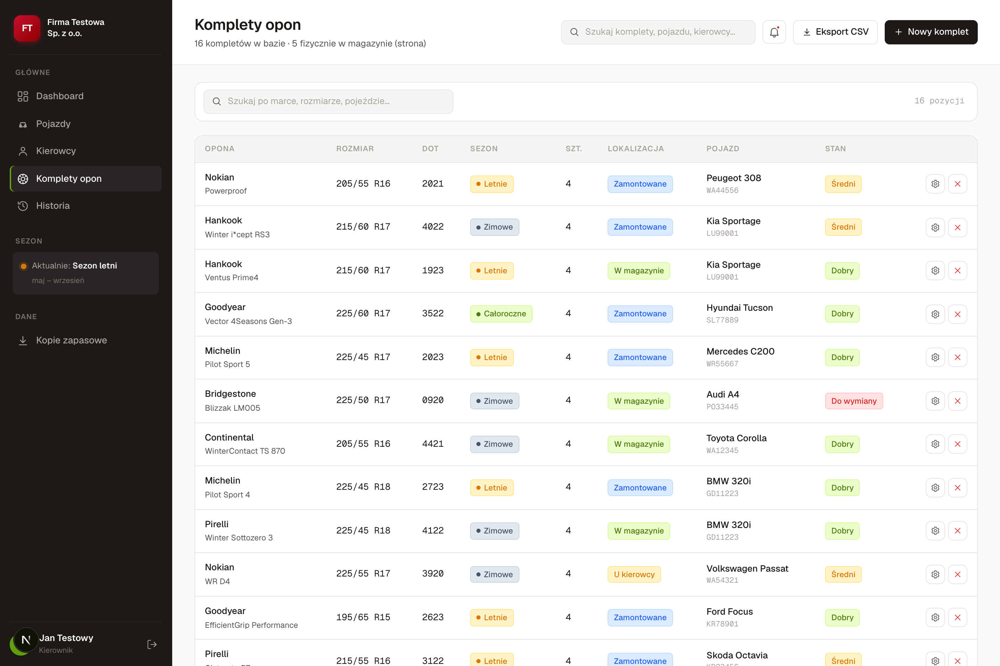
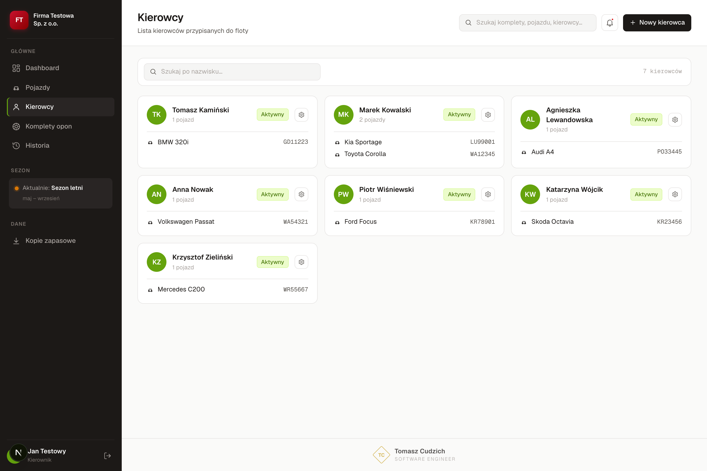

# Magazyn Opon — ewidencja opon dla floty 120 pojazdów

Aplikacja webowa dla zakładu produkcyjnego z flotą 120 pojazdów. **Produkcja,
używana codziennie przez warsztat klienta.** Pierwszy system, jaki dla nich
zbudowałem — po nim wrócili po drugi.

> Kod jest prywatny, bo aplikacja pracuje na danych pojazdów i kierowców firmy.
> Dane na zrzutach są zmyślone („Firma Testowa”, „Jan Testowy”).

## Problem

Komplety opon prowadzone były w arkuszu, terminy przeglądów pilnowane z pamięci,
a koszty eksploatacji rozproszone po fakturach. Pytanie „gdzie leżą zdjęte opony
z tego auta i ile mają jeszcze bieżnika” wymagało znalezienia właściwej osoby.

## Co zbudowałem

- **kartoteki** pojazdów, kierowców i kompletów opon z katalogiem 44 pozycji;
- **pełna historia wymian sezonowych** — każdy komplet ma swoją oś czasu,
  z notatkami przy pozycjach;
- **powiadomienia o terminach** wymian;
- **eksport CSV** do dalszych rozliczeń;
- **autoryzacja sesyjna** (NextAuth v5, JWT ważny 30 dni), konta konfigurowane
  zmiennymi środowiskowymi;
- **automatyczna kopia bazy** uruchamiana cronem Vercela o 01:00 UTC, z
  podglądem migawek w aplikacji;
- responsywnie — działa na telefonie bezpośrednio na hali.

| Pojazdy | Komplety opon | Kierowcy |
|---|---|---|
|  |  |  |

## Efekt

Stan opon dla całej floty jest widoczny od ręki, bez pytania kogokolwiek.
Klient korzysta codziennie i wrócił po [drugi system](../system-danych-floty).

## Stack

`Next.js` · `TypeScript` · `Prisma` · `PostgreSQL` (`@prisma/adapter-pg`) ·
`NextAuth v5` · `Vercel` (wdrożenia, cron)

36 commitów, 6 migracji rozłożonych w czasie — w tym `add_indexes`
i `add_backup_snapshot`, czyli zmiany robione pod realny ruch, a nie przy
zakładaniu projektu.
