# SKYLOS Twisted Trails — system obsługi zawodów sportowych

Kompletna obsługa zawodów psich zaprzęgów w jednym systemie: od zapisów, przez
odprawę weterynaryjną, biuro zawodów, stake-out i sędziów, po wyniki na żywo
i analizę odcinków. Na telefonie każdego, kto jest na terenie.

**Status:** produkcja. Zapisy prowadzone przez system, w bazie 71 zgłoszeń
i 101 psów. Zawody: 2–4 października 2026, Świniarsko koło Nowego Sącza.

| | |
|---|---|
| Commity | 324 (30.06 – 10.09.2026) |
| Kod | ~53 000 linii TypeScriptu w `src`, 300 plików |
| Ekrany | 45 |
| Role użytkowników | 13, każda z odrębnym dostępem |
| Migracje bazy | 75 |
| Testy | 24 pliki, `node:test` |

> **Kod jest prywatny** — system pracuje na danych zawodników, skanach paszportów
> i książeczek szczepień psów. Jawną część można obejrzeć i uruchomić:
> [wyszukiwarka regulaminu](../wyszukiwarka-regulaminu).
>
> Wszystkie dane na zrzutach poniżej są zmyślone — podmieniane w przeglądarce
> tuż przed zrzutem, bez zapisu do bazy.

---

## Problem

Zawody psich zaprzęgów prowadzi się dziś na segregatorach, arkuszach
kalkulacyjnych, grupach na komunikatorach i kartkach w kieszeni kurtki.
Wszystko działa — dopóki ktoś o coś nie zapyta.

Weterynarz pyta, czy ten pies był już sprawdzony. Biuro pyta, czy ten zawodnik
zapłacił i odebrał pakiet. Sędzia przy proteście pyta, kto z kim i w jakiej
klasie startował. Kierownik stake-outu pyta, gdzie stoi ten zaprzęg. Zawodnik
pyta, za co dokładnie dostał ostrzeżenie.

Odpowiedź na każde z tych pytań gdzieś jest — tylko nie tam, gdzie stoi osoba,
która pyta, i nie wtedy, kiedy pyta.

---

## Zanim ktokolwiek przyjedzie

Zgłoszenia z systemu związkowego MMS dociągają się same, co godzinę (cron).
Organizator nie przepisuje nikogo ręcznie i nie pracuje na dwóch listach.

Odprawa weterynaryjna dzieje się w domu: zawodnik wpisuje numer chipa psa
i wgrywa zdjęcia paszportu, szczepień i obu stron rodowodu — wieczorem, bez
zakładania konta i bez kolejki. Wszystko kluczowane **numerem chipa**, więc pies
przeniesiony między zawodnikami niesie swoją odprawę ze sobą.

| Odprawa online | Wyszukiwarka regulaminu | Zasady na trasie |
|---|---|---|
| 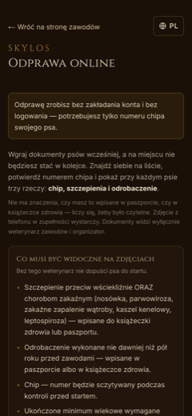 |  | 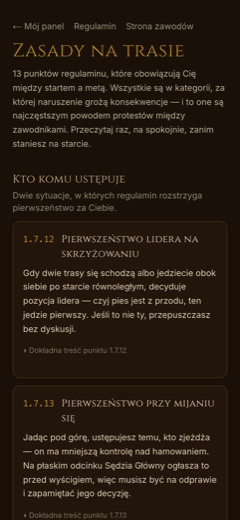 |

## Wjazd na teren

Biuro odhacza check-in w pięciu krokach — płatność, oświadczenie o zdrowiu,
pakiet startowy, kontrola weterynaryjna, odprawa — wydaje numery startowe
i przyjmuje paszporty do depozytu. Zawodnik widzi u siebie ten sam stan
i przestaje pytać.

Weterynarz pracuje psem, nie kartką: lista pogrupowana po zawodniku, szukanie po
chipie, dokumenty przeglądane jak zdjęcia w galerii, zatwierdzanie z poziomu
zdjęcia.

| Biuro zawodów | Panel weterynarza | Stake-out |
|---|---|---|
| 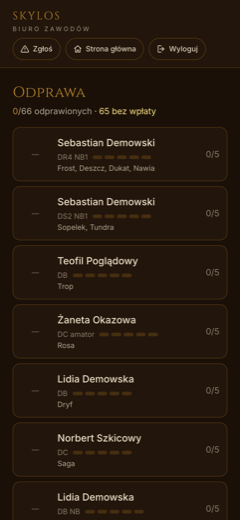 | 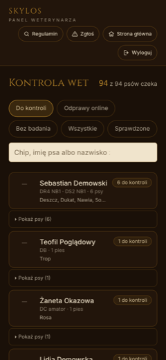 | 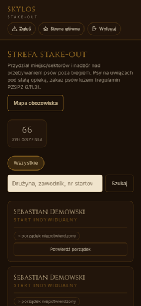 |

Gastronomia przestaje prowadzić listy: zawodnik ma w telefonie kod QR na każdy
posiłek, który mu przysługuje, wolontariusz skanuje, ekran mówi wielkimi literami
co wydać, a kod gaśnie po użyciu. **Pod kodem stoi ta sama wartość tekstem** — na
wypadek słońca na ekranie albo braku zasięgu w kolejce.

| Kody na posiłki | Skaner | Co wydać |
|---|---|---|
| 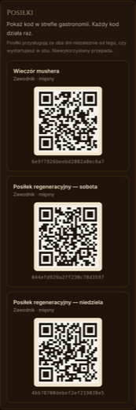 | 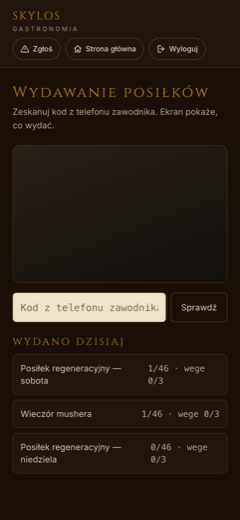 |  |

## Dzień startu

Lista startowa układa się sama — z czasów poprzedniego etapu, z numerów
startowych albo z losowania, zależnie od formuły. Sędzia startu widzi niesprawny
sprzęt i wpisuje wniosek jednym dotknięciem: wybiera podstawę, a system
podpowiada punkt regulaminu i sam dopisuje go do uzasadnienia. Wniosek trafia do
Sędziego Głównego, bo **tylko on może ukarać**.

| Lista startowa | Panel sędziego | Podpowiedź punktu regulaminu |
|---|---|---|
| 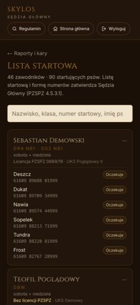 | 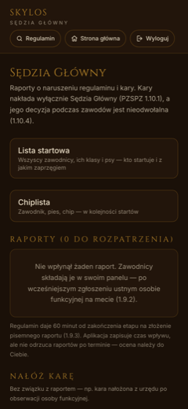 | 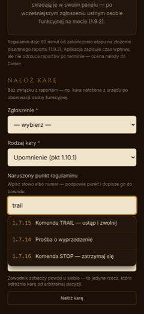 |

Chiplista dla sędziego startu to trzy kolumny — zawodnik, pies, chip — w
kolejności startów, do czytania przy czytniku, w rękawiczkach. Nic poza tym, bo
każda dodatkowa kolumna odsuwa numer w bok.

## Na trasie

Zaprzęgi widać na mapie na żywo. Aplikacja nadaje w tle — telefon może leżeć
zablokowany w kieszeni — i **buforuje pozycje, gdy zabraknie zasięgu**.

Wezwanie pomocy to jedno dotknięcie, bez pytania „czy na pewno”. Leci nazwisko,
numer startowy i lokalizacja, a widzi je cała ekipa naraz: organizator, biuro,
weterynarz, stake-out, sędzia i gastronomia — bo przy człowieku leżącym na trasie
zawężanie kręgu odbiorców nie ma sensu.

| Przejazd na żywo | Mapa terenu | Obozowisko |
|---|---|---|
| 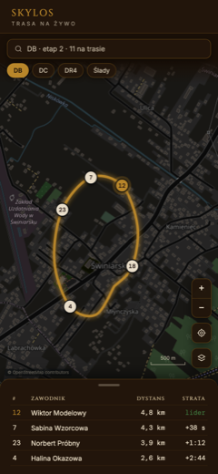 | 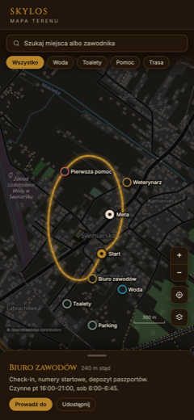 | 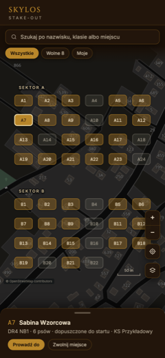 |

## Meta i wyniki

| Wyniki na żywo | Analiza odcinków | Mistrzowie odcinków |
|---|---|---|
| 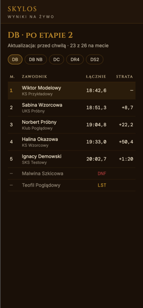 | 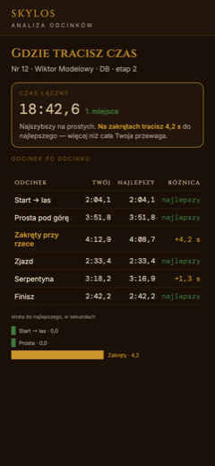 | 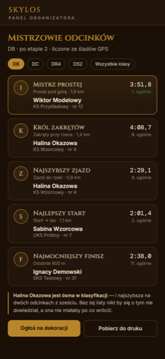 |

Analiza odcinków odpowiada zawodnikowi na pytanie, którego nie zada nikomu:
**gdzie tracisz czas**. Porównanie jego czasów z najlepszymi na każdym odcinku,
z jawną stratą.

---

## Co z tego jest inżynierią, a nie funkcją

**Kopie zapasowe, które da się odtworzyć.** Zrzut bazy szyfrowany AES-256-CBC
z PBKDF2 (200 000 iteracji), z manifestem zawierającym stan bazy i dosłowne
polecenia odtworzenia, wysyłany poza serwer. Manifest mówi też wprost, czego
odtworzyć się **nie** da: hasła w `auth.users` są haszowane przez GoTrue i zależą
od instancji, więc przy odtwarzaniu do nowego projektu konta zakłada się
skryptem, a plik traktuje jako listę adresów i ról.

**Nagłówki bezpieczeństwa dobrane, nie skopiowane.** CSP z `frame-ancestors
'none'`, `object-src 'none'` i `connect-src` ograniczonym do siebie i Supabase.
`Permissions-Policy` wpuszcza `camera=(self)` i `geolocation=(self)` — bo pusta
lista wyłącza je także dla nas i przeglądarka odmawia bez pytania użytkownika
o zgodę. To była prawdziwa przyczyna tego, że skaner posiłków nie działał na
żadnym telefonie.

**Kontrast dobrany pomiarem.** Zawodnicy zgłosili, że „elementy nie są od siebie
wizualnie oddzielone”. Przyczyna była mierzalna: tło strony i tło karty różniły
się o 2,6 punktu jasności percepcyjnej L\* — dla oka to jeden kolor. Nowe warstwy
różnią się o 7,8 i 8,4 punktu, przy zachowanym kontraście tekstu 13,6:1.
Rozumowanie zostało w komentarzu w `globals.css` — plik jest w całości do
obejrzenia w [demie regulaminu](../wyszukiwarka-regulaminu/src/app/globals.css).

**Uprawnienia egzekwowane w bazie, nie w interfejsie.** Na tabelach kar
i wniosków o ukaranie klient nie ma żadnych praw zapisu — `revoke all from anon,
authenticated`, a potem wyłącznie `grant select`. Zapis idzie przez kod serwerowy,
więc ukrycie przycisku w interfejsie nie jest tu zabezpieczeniem, tylko wygodą.

Ciekawsza jest polityka odczytu: **zawodnik nie widzi wniosku, w którym został
wskazany** — widzi tylko te, które sam złożył. To nie jest przeoczenie, tylko
regulamin PZSPZ 1.9.4: obwiniony ma zostać *wysłuchany* przez Sędziego Głównego,
a nie przeczytać zarzut w telefonie i przyjść z gotową odpowiedzią. Nałożoną karę
i jej powód widzi już zawsze. Cała reguła to jedna polityka RLS z komentarzem
wyjaśniającym, skąd się wzięła.

**Wyłącznik, który zostaje w kodzie.** Automatyczne dopinanie zgłoszeń do kont da
się wyłączyć zmienną środowiskową, a wyłączenie widać w logu synchronizacji — bo
cicha przerwa wygląda tak samo jak zepsute dopinanie.

## Stack

`Next.js 16 (App Router)` · `TypeScript` · `Supabase / PostgreSQL` (75 migracji,
42 polityki RLS) · `Leaflet` · `web-push` · `zod` · `react-hook-form` · `Playwright` ·
`Vercel` (wdrożenia, cron)
