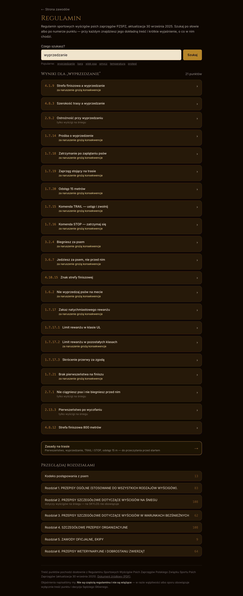

# Wyszukiwarka regulaminu PZSPZ

Moduł wyjęty z systemu **SKYLOS Twisted Trails**. Regulamin sportowych wyścigów
psich zaprzęgów rozłożony na **447 punktów** w 7 rozdziałach — każdy z dosłowną
treścią i osobnym wyjaśnieniem prostym językiem. Szuka się po frazie albo po
numerze.

To jest **kod produkcyjny, nie przykład napisany na potrzeby portfolio**. Da się
go pokazać w całości, bo ta część systemu jest jawna także u klienta: regulaminu
potrzebuje najbardziej ktoś, kto dopiero się zapisuje i konta jeszcze nie ma.

```bash
npm install
npm run dev     # → http://localhost:3000
npm test        # 21 testów jednostkowych
```



## Skąd się wziął

> Zawodnik, 02.09.2026: *„jako mniej doświadczony zawodnik chcę się
> dowiedzieć, jak to jest z tym wyprzedzaniem, ale nie wiem który to punkt ani
> nic — wpisuję »wyprzedzanie« i wyskakują mi wszystkie punkty, które o tym
> mówią"*.

Wpisanie „wyprzedzanie” zwraca 21 punktów, uszeregowanych według trafności, z
oznaczeniem, za które z nich grożą konsekwencje i które dotyczą wyłącznie
wyścigów na śniegu (SKYLOS jest drylandowy).

## Trzy decyzje, które widać w kodzie

**Szukanie po stronie serwera, formularzem GET.** Cały regulamin to ponad 300 kB.
Wysyłanie go do telefonu, żeby przeszukać na miejscu, kosztowałoby więcej niż
samo szukanie. Efekt uboczny: działa bez JavaScriptu, a wynik zostaje w adresie,
więc da się go komuś wysłać linkiem.

**Treść i wyjaśnienie wyglądają inaczej — i to nie jest ozdoba.** Treść punktu
jest dosłowna i wiążąca, wyjaśnienie jest nasze i nie jest przepisem. Gdyby
wyglądały tak samo, ktoś zacytowałby na proteście nasze zdanie zamiast
regulaminu.

**Wyszukiwarka nie udaje wyników.** Rdzeń ucina końcówki fleksyjne, ale nie zjada
krótkich słów; dwa słowa zawężają zapytanie, a nie rozmywają; kiedy nic nie
pasuje, wynik jest pusty. Każde z tych zachowań ma swój test.

## Testy

21 testów w `node:test`, bez frameworka. Dwie grupy:

- **`szukaj.test.ts`** — zachowanie wyszukiwarki: `krótkie słowo nie trafia
  w dłuższe, które tak samo się zaczyna`, `nic nie pasuje = pusto, bez udawania
  wyników`, `numery porządkują się liczbowo, nie alfabetycznie`.
- **`dane.test.ts`** — spójność danych z resztą systemu. Ten test istnieje przez
  konkretną wpadkę: przy lince do canicrossu stało „pkt 3.5”, a 3.5 to „Starty
  dzieci” — właściwy wymóg jest w 3.2.1. Numer wyglądał wiarygodnie i nikt by go
  nie sprawdził, dopóki zawodnik w niego nie kliknął.

## Czym różni się od wersji produkcyjnej

Jedną rzeczą: **odpięta jest warstwa sesji**. W SKYLOSIE zalogowany użytkownik
widzi tu dodatkowy link do swojego panelu, a ścieżka zależy od jego roli. Zmiana
jest opisana komentarzem w `src/app/regulamin/page.tsx`.

Poza tym `dane.test.ts` nie zawiera testów spinających regulamin z modułami,
których w tym wycinku nie ma (wymagane wyposażenie, panel sędziego) — jest to
zaznaczone w pliku.

W komentarzach imię zawodnika, który zgłaszał uwagi, zastąpiłem jego rolą.
Cytaty są dosłowne, ale nie publikuję cudzego imienia bez pytania.

## Stack

`Next.js 16 (App Router)` · `TypeScript` · `React 19` · `Tailwind CSS v4` ·
`node:test`. Zero zależności runtime poza Next i Reactem — dane regulaminu są
w repozytorium jako TypeScript, nie w bazie.
